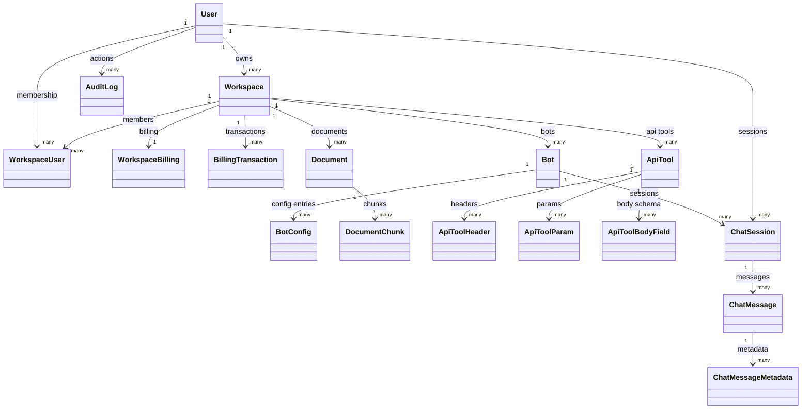

# Class Architecture

## 1) UML Class Diagrams

### 1.1 Domain Entities (SQLAlchemy)

### 1.2 Repository → Service

```mermaid
classDiagram
    class AuthRepository
    class WorkspaceRepository
    class BillingRepository
    class UsageRepository
    class AuditRepository
    class ApiToolRepository
    class DocumentRepository
    class ChatRepository
    class BotRepository

    class AuthService
    class WorkspaceService
    class BillingService
    class UsageService
    class AuditService
    class ApiToolsService
    class DocumentService
    class ChatService
    class BotService
    class GeminiModelsService
    class LangChainService
    class DocumentProcessor
    class VectorStoreService

    AuthService --> AuthRepository
    WorkspaceService --> WorkspaceRepository
    BillingService --> BillingRepository
    UsageService --> UsageRepository
    AuditService --> AuditRepository
    ApiToolsService --> ApiToolRepository
    DocumentService --> DocumentRepository
    ChatService --> ChatRepository
    BotService --> BotRepository
    LangChainService --> ApiToolRepository
    DocumentService --> DocumentProcessor
    DocumentService --> VectorStoreService
```

### 1.3 Controller → Service

```mermaid
classDiagram
    class AuthController {
        +register()
        +login()
        +refresh_token()
        +get_current_user_profile()
    }
    class WorkspaceController {
        +create_workspace()
        +get_workspaces()
        +get_workspace()
        +list_workspace_users()
        +add_user_to_workspace()
        +remove_user_from_workspace()
    }
    class BillingController {
        +get_billing_summary()
        +get_plan_limits_for_workspace()
        +get_billing_transactions()
        +get_spending_usage()
        +create_subscription_checkout()
        +create_topup_checkout()
        +create_billing_portal()
        +switch_to_trial_plan()
        +stripe_webhook()
    }
    class UsageController {
        +get_token_usage()
        +list_token_usage_models()
    }
    class AuditController {
        +list_audit_logs()
        +get_audit_log()
    }
    class ApiToolsController {
        +create_api_tool()
        +get_api_tools()
        +get_api_tool()
        +update_api_tool()
        +delete_api_tool()
    }
    class DocumentController {
        +upload_document()
        +get_documents()
        +get_document()
        +delete_document()
    }
    class ChatController {
        +send_message()
        +get_chat_messages()
        +get_chat_sessions()
    }
    class BotController {
        +create_bot()
        +get_bots()
        +get_bot()
        +update_bot()
        +delete_bot()
    }
    class GeminiModelsController {
        +list_gemini_chat_models()
    }

    class AuthService
    class WorkspaceService
    class BillingService
    class UsageService
    class AuditService
    class ApiToolsService
    class DocumentService
    class ChatService
    class BotService
    class GeminiModelsService

    AuthController --> AuthService
    WorkspaceController --> WorkspaceService
    BillingController --> BillingService
    UsageController --> UsageService
    AuditController --> AuditService
    ApiToolsController --> ApiToolsService
    DocumentController --> DocumentService
    ChatController --> ChatService
    BotController --> BotService
    GeminiModelsController --> GeminiModelsService
```

---

## 2) Domain layer (`app/db/models.py`)

ORM-сущности: только маппинг на таблицы и поля. У большинства классов **нет** собственных методов Python.

### `Base`

Базовый `DeclarativeBase` SQLAlchemy для всех моделей.

### `TemperatureNumeric`

`TypeDecorator` для поля температуры бота: приведение к `Decimal` и совместимость с NUMERIC/TEXT.

**`process_bind_param(value, dialect)`** — пишет в БД строку с двумя знаками после запятой.

**`process_result_value(value, dialect)`** — читает из БД в `Decimal` (по умолчанию 0.7 при `None`).

### `User`

Учётная запись: email, хеш пароля, имя, флаг активности, дата создания.

*Методов нет.*

### `Workspace`

Рабочая область: имя, владелец (`owner_id`), дата создания.

*Методов нет.*

### `WorkspaceUser`

Связь пользователь–воркспейс: роль, дата добавления; составной PK.

*Методов нет.*

### `WorkspaceBilling`

Биллинг воркспейса: план, Stripe, баланс, даты trial/подписки. PK = `workspace_id`.

*Методов нет.*

### `BillingTransaction`

Неприводимая проводка: тип, сумма, связь с сообщением/Stripe, JSON-метаданные.

*Методов нет.*

### `Bot`

Бот: имя, воркспейс, system prompt, температура, max_tokens, связь с `BotConfig`.

*Методов нет.*

### `BotConfig`

Пара «ключ — значение — тип» для графа/настроек бота; уникальность по `(bot_id, config_key)`.

*Методов нет.*

### `Document`

Загруженный файл: путь, размер, тип, статус обработки, ошибка, дата обработки.

*Методов нет.*

### `DocumentChunk`

Фрагмент текста документа, индекс чанка, id эмбеддинга в векторном хранилище.

*Методов нет.*

### `ApiTool` / `ApiToolHeader` / `ApiToolParam` / `ApiToolBodyField`

Определение HTTP-инструмента и вложенные части: заголовки, query/body params, схема body (с `parent_field_id`).

*Методов нет.*

### `ChatSession` / `ChatMessage` / `ChatMessageMetadata`

Сессия чата, сообщение, пары key/value метаданных (токены, модель и т.д.).

*Методов нет.*

### `AuditLog`

Запись аудита: действие, таблица, id записи, старые/новые данные, IP, user agent.

*Методов нет.*

---

## 3) Core / инфраструктура

### `Settings` (`app/core/config.py`)

Конфигурация из переменных окружения (`BaseSettings`); синглтон `settings`. БД, JWT, Gemini, логи, Stripe, пути загрузки.

*Отдельных методов нет (поля Pydantic).*

### `engine`, `SessionLocal`, `get_db`, `db_session`, `set_session_user_id` (`app/db/database.py`)

Жизненный цикл сессии БД: dependency для FastAPI, сессия для фоновых задач, `SET LOCAL app.user_id` для аудита.

**`get_db()`** — yield сессии, rollback при ошибке, закрытие в `finally`.

**`db_session()`** — новая сессия; вызывающий закрывает.

**`set_session_user_id(session, user_id)`** — прокидывает user id в PG для триггеров.

### Модуль `security` (`app/core/security.py`)

Не класс. Хеширование PBKDF2, создание/проверка пароля, JWT access/refresh и декодирование.

**`get_password_hash` / `verify_password`** — хранение и проверка пароля.

**`create_access_token` / `create_refresh_token`** — выпуск токенов.

**`decode_access_token` / `decode_refresh_token`** — разбор токенов.

### `SCHEMA_STATEMENTS`, `apply_schema` (`app/db/schema.py`)

Сырой SQL схемы и индексов; **apply_schema** выполняет скрипты на соединении.

### `plan_guard` (`app/services/plan_guard.py`)

Функции (не класс): проверка подписки, лимитов документов/ботов/сообщений, разрешённой модели, положительного баланса.

**`enforce_subscription_active`** — бросает 402, если подписка неактивна.

**`enforce_document_limit` / `enforce_bot_limit` / `enforce_message_limit`** — лимиты плана.

**`enforce_model_allowed`** — модель разрешена тарифом.

**`enforce_positive_balance`** — баланс должен быть больше нуля для чата.

---

## 4) Repository layer

### `AuthRepository` (`app/db/auth_repository.py`)

Пользователь и воркспейс при регистрации.

**`get_user_by_email`** — поиск пользователя по email.

**`create_user`** — создание пользователя.

**`create_workspace`** — воркспейс + инициализация биллинга.

**`list_workspaces_for_owner`** — список воркспейсов владельца.

### `WorkspaceRepository`

Воркспейсы, доступ, участники.

**`create_workspace`** — создание с биллингом.

**`list_all_workspaces_for_user`** — владение + membership.

**`check_user_workspace_access`** — воркспейс и роль (owner/member) или `None`.

**`get_workspace_for_owner`** — только владелец.

**`list_workspace_users`** — участники с email/ролью.

**`get_user_by_email`** — полные поля, включая хеш (для приглашений).

**`add_user_to_workspace` / `remove_user_from_workspace`** — merge/delete участника.

### `BillingRepository`

Состояние биллинга, проводки, агрегаты трат.

**`get_workspace_billing` / `ensure_workspace_billing`** — чтение или создание строки биллинга.

**`get_workspace_billing_by_customer_id` / `get_workspace_billing_by_subscription_id`** — поиск по Stripe.

**`update_workspace_billing`** — частичное обновление.

**`create_billing_transaction`** — запись проводки.

**`list_billing_transactions`** — история.

**`has_billing_transaction_for_stripe_event`** — идемпотентность webhook.

**`adjust_workspace_balance`** — изменение `balance_usd`.

**`count_*_for_workspace`** — счётчики документов, ботов, user-сообщений.

**`get_spending_totals` / `get_spending_buckets`** — SQL-агрегаты по `billing_transactions`.

### `UsageRepository`

Аналитика токенов и проверка бота в воркспейсе.

**`get_bot_for_user`** — бот, если пользователь владеет или member.

**`get_token_usage_totals` / `get_token_usage_buckets`** — SQL по metadata сообщений.

**`list_distinct_models_for_token_usage`** — уникальные модели в периоде.

### `AuditRepository`

**`list_audit_logs`** — пагинированный список с join к User.

**`count_audit_logs`** — всего с фильтрами.

**`get_audit_log_by_id`** — одна запись с email пользователя.

### `ApiToolRepository`

CRUD инструмента, загрузка headers/params/body.

**`create_api_tool`** — родитель + дочерние строки.

**`list_api_tools_for_workspace` / `get_api_tool_for_user` / `get_api_tool_for_owner`**

**`update_api_tool_for_owner` / `delete_api_tool_for_owner`**

**`get_api_tools_by_ids`** — пачка по id в воркспейсе (для LangGraph).

### `DocumentRepository`

**`create_document` / `list_documents_for_workspace`**

**`get_document_for_user` / `get_document_for_owner` / `get_document_by_id`**

**`list_chunk_embedding_ids` / `insert_document_chunk` / `update_chunk_embedding_id`**

**`update_document_status` / `delete_document_by_id`**

### `ChatRepository`

Сессии, сообщения (через SQL `create_chat_message`), прокси к биллингу.

**`get_bot_for_user`** — через `BotRepository`.

**`get_chat_session_for_user` / `create_chat_session`**

**`insert_chat_message`** — вызов PG-функции, обновление счётчика сессии.

**`list_messages_for_session` / `list_chat_sessions_for_user`**

**`adjust_workspace_balance` / `create_billing_transaction`** — через `BillingRepository`.

### `BotRepository`

**`create_bot` / `list_bots_for_user` / `get_bot_for_user` / `get_bot_for_owner`**

**`update_bot_for_owner` / `delete_bot_for_owner`**

**`list_documents_for_workspace` / `list_api_tools_for_workspace`** — делегаты для валидации графа.

### Утилиты `app/db/repository_utils.py`

Функции маппинга ORM → dict и CTE для usage (`user_to_dict`, `bot_to_dict`, `api_tool_to_dict`, …). Не класс.

---

## 5) Service layer

### `AuthService`

**`register_user`** — уникальность email, хеш, пользователь, дефолтный воркспейс, commit.

**`login_user`** — проверка пароля и `is_active`, выдача токенов.

**`refresh_tokens`** — валидация refresh JWT и новая пара токенов.

**`build_user_profile`** — профиль + список воркспейсов владельца.

**`_issue_tokens`** — формирование access + refresh.

### `WorkspaceService`

**`create_workspace` / `list_user_workspaces` / `get_workspace_for_user`**

**`list_workspace_users_for_owner` / `add_user_to_workspace` / `remove_user_from_workspace`**

**`_ensure_workspace_owner`** — 403, если не владелец.

### `PlanLimits` (dataclass в `billing_service.py`)

Непизменяемое описание лимитов: документы, модели, боты, сообщения. Используется в `PLAN_LIMITS`.

### Функции `billing_service.py` (модуль)

**`normalize_model_name` / `get_plan_limits` / `calculate_llm_cost_usd`**

**`is_workspace_subscription_active` / `trial_end_datetime`**

### `BillingService`

**`get_or_create_billing_summary` / `get_plan_limits_info`** — snapshot и флаги «можно ли» (загрузка, боты, чат).

**`get_spending`** — тоталы и ведра по времени.

**`create_subscription_checkout` / `create_topup_checkout` / `create_billing_portal`**

**`switch_to_trial_plan`**

**`handle_stripe_webhook`** — подписка, top-up, invoice, сбой оплаты, обновление subscription.

**`_init_stripe` / `_get_plan_price_id` / `_align_bucket_start` / `_fill_spending_buckets`**

### `UsageService`

**`get_token_usage` / `list_token_usage_models`** — период, валидация «`time_from` раньше `time_to`» и длины, проверка `bot_id`.

**`_utc` / `_align_bucket_start` / `_fill_time_buckets` / `_validate_range` / `_validate_bot_access`**

### `AuditService`

**`list_audit_logs`** — список + total.

**`get_audit_log`** — по id или 404.

### `ApiToolsService`

**`create_api_tool` / `list_api_tools_for_workspace` / `get_api_tool_for_user`**

**`update_api_tool_for_owner` / `delete_api_tool_for_owner`**

**`_normalize_method`** — только GET, POST, PUT, PATCH, DELETE.

### `DocumentService`

**`upload_document`** — валидация размера/типа, запись файла, `create_document`, фон `process_document_async`.

**`list_documents_for_workspace` / `get_document_for_user` / `delete_document_for_owner`**

**`_validate_and_extract_file_type`**

### `ChatService`

**`send_message`** — сессия, user msg, LangChain, assistant msg, списание баланса.

**`list_chat_messages` / `list_chat_sessions`**

**`_get_or_create_session` / `_apply_usage_charge`**

### `BotService`

**`create_bot` / `list_bots_for_user` / `get_bot_for_user` / `update_bot_for_owner` / `delete_bot_for_owner`**

**`validate_graph_config`** — уникальность узлов, entry, ссылки на документы/инструменты, переходы.

**`_validate_system_prompt`**

### `GeminiModelsService`

**`list_chat_models`** — кешированный список моделей с `generateContent` (в процессе — `lru_cache` в модуле).

### `LangChainService`

**`build_graph_from_config` / `process_message`** — LangGraph, узлы, инструменты RAG + API, агрегат usage.

**`create_rag_tool` / `create_api_tool`** — `StructuredTool` для графа.

**`__init__` / `_get_llm` / вспомогательные `_normalize_graph_config`, `_make_node_executor`, `_make_transition_selector`, и т.д.**

Синглтон: `langchain_service`.

### `ApiToolArgsSchema` (Pydantic в `langchain_service.py`)

**`model_config` extra=allow** — схема аргументов для внутренних сценариев.

### `DocumentProcessor`

**`process_pdf` / `process_docx` / `process_txt` / `process_document`**

**`split_text_into_chunks`**

### `process_document_async` (`document_processor_service.py`)

Асинхронная фоновая обработка: извлечь текст, чанки, эмбеддинги, статус `processed`/`failed`.

### `VectorStoreService`

**`add_chunks` / `delete_embeddings` / `search_similar_chunks`**

### `VectorSearchResult` (dataclass)

**Поля** `page_content`, `metadata` — результат поиска по векторам.

---

## 6) DTO (Pydantic, эндпоинты)

Схемы запрос/ответ. Ниже — классы с нестандартным поведением; остальные только поля.

### `UserRegister`

**`field_validator` для `password`** — не длиннее 72 байт (ограничение хеша).

### `ChatMessageResponse`

**`from_chat_message(cls, msg)`** — маппинг `message_metadata` → `metadata` в ответе.

### `TransitionCondition` / `BotGraphConfig` (bots)

**Валидаторы** — для `keyword` нужен `value`, парсинг `nodes` из JSON/литерала, очистка `entry_node_id` от кавычек.

### Остальные DTO

`UserResponse`, `Token`, `UserProfile`, `RefreshRequest`, `WorkspaceCreate`, ответы workspace/billing/usage/api-tools/documents/chat/bots/gemini` — наборы полей без логики (кроме перечисленного).

### `app/api/dependencies.py`

**`get_current_user` / `get_user_workspace` / `check_workspace_access`** — не классы, async Depends: JWT, проверка владельца/доступа.

---

## 7) Controller layer (логика в функциях `APIRouter`)

Префикс API: `/api/v1`. Классы ниже — **логическая** модель; в коде — модуль + функции с теми же именами. Там, где не указан HTTP, смотрите путь: первый сегмент после префикса контроллера.

### `AuthController` — `endpoints/auth.py` → `/auth`

**`register`** — POST `/register` — регистрация.

**`login`** — POST `/login` — форма OAuth2, токены.

**`refresh_token`** — POST `/refresh` — обновление access.

**`get_current_user_profile`** — GET `/me` — профиль.

### `WorkspaceController` — `workspaces.py` → `/workspaces`

**`create_workspace`** — POST `/`

**`get_workspaces`** — GET `/`

**`get_workspace`** — GET `/{workspace_id}`

**`list_workspace_users`** — GET `/{workspace_id}/users`

**`add_user_to_workspace`** — POST `/{workspace_id}/users`

**`remove_user_from_workspace`** — DELETE `/{workspace_id}/users/{user_id}`

### `BillingController` — `billing.py` → `/billing`

**`get_billing_summary`** — GET `/summary`

**`get_plan_limits_for_workspace`** — GET `/limits`

**`get_billing_transactions`** — GET `/transactions`

**`get_spending_usage`** — GET `/spending`

**`create_subscription_checkout`** — POST `/checkout/subscription`

**`create_topup_checkout`** — POST `/checkout/topup`

**`create_billing_portal`** — POST `/portal`

**`switch_to_trial_plan`** — POST `/plan/trial`

**`stripe_webhook`** — POST `/webhook`

### `UsageController` — `usage.py` → `/usage`

**`get_token_usage`** — GET `/tokens`

**`list_token_usage_models`** — GET `/tokens/models`

### `AuditController` — `audit.py`

Фактический путь: **`/api/v1/audit/audit/...`** (двойной префикс в роутере).

**`list_audit_logs`** — GET `/logs`

**`get_audit_log`** — GET `/logs/{log_id}`

### `ApiToolsController` — `api_tools.py` → `/api-tools`

**`create_api_tool`** — POST `/`

**`get_api_tools`** — GET `/` (query `workspace_id`)

**`get_api_tool`** — GET `/{tool_id}`

**`update_api_tool`** — PUT `/{tool_id}`

**`delete_api_tool`** — DELETE `/{tool_id}`

### `DocumentController` — `documents.py` → `/documents`

Query **`workspace_id`** для POST и GET списка.

**`upload_document` / `get_documents` / `get_document` / `delete_document`**

### `ChatController` — `chat.py` → `/chat`

**`send_message`** — POST `/` — guard плана + `ChatService`.

**`get_chat_messages`** — GET `/sessions/{session_id}/messages`

**`get_chat_sessions`** — GET `/sessions`

### `BotController` — `bots.py` → `/bots`

**`create_bot` / `get_bots` / `get_bot` / `update_bot` / `delete_bot`**

### `GeminiModelsController` — `gemini_models.py` → `/gemini`

**`list_gemini_chat_models`** — GET `/chat-models`

### `app/main.py`

**`root`** — GET `/` — приветствие.

**`health_check`** — GET `/health` — health.

---

*Актуально для текущей ветки `AI-platform`; при смене кода сверяйте с исходниками.*
