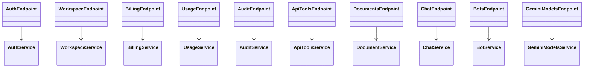

# Class Architecture (Entity -> Repository -> Service -> Controller)

## 1) UML Class Diagrams

### 1.1 Domain Entities (SQLAlchemy)

### 1.2 Layered Application Classes

```mermaid
classDiagram
    class AuthRepository
    class WorkspaceRepository
    class BillingRepository
    class UsageRepository
    class AuditRepository
    class ApiToolRepository
    class DocumentRepository
    class ChatRepository
    class BotRepository

    class AuthService
    class WorkspaceService
    class BillingService
    class UsageService
    class AuditService
    class ApiToolsService
    class DocumentService
    class ChatService
    class BotService
    class GeminiModelsService
    class LangChainService
    class DocumentProcessor
    class VectorStoreService

    AuthService --> AuthRepository
    WorkspaceService --> WorkspaceRepository
    BillingService --> BillingRepository
    UsageService --> UsageRepository
    AuditService --> AuditRepository
    ApiToolsService --> ApiToolRepository
    DocumentService --> DocumentRepository
    ChatService --> ChatRepository
    BotService --> BotRepository
    LangChainService --> ApiToolRepository
    DocumentService --> DocumentProcessor
    DocumentService --> VectorStoreService
```

### 1.3 Controller/DTO Flow (FastAPI style)

---

## 2) Description of Every Class

## Core / Base

- `Settings` (`app/core/config.py`) - central app configuration from env (`BaseSettings`).
- `Base` (`app/db/models.py`) - SQLAlchemy declarative base class for ORM entities.
- `TemperatureNumeric` (`app/db/models.py`) - custom SQLAlchemy type decorator for safe numeric temperature conversion.

## Entity Classes (ORM)

- `User` - user account (identity, credentials, active status).
- `Workspace` - tenant/work area owned by a user.
- `WorkspaceUser` - many-to-many membership link between users and workspaces with role.
- `WorkspaceBilling` - billing aggregate for a workspace (plan, subscription, balance).
- `BillingTransaction` - immutable billing movement (top-up, charge, subscription payment, etc.).
- `Bot` - assistant/bot configuration root inside a workspace.
- `BotConfig` - flexible key-value bot settings (graph/config schema persisted as entries).
- `Document` - uploaded source file in a workspace.
- `DocumentChunk` - chunked text fragment of a document, optionally linked to vector embedding id.
- `ApiTool` - external API tool definition available to bot flows.
- `ApiToolHeader` - HTTP headers config for `ApiTool`.
- `ApiToolParam` - query/body param defaults for `ApiTool`.
- `ApiToolBodyField` - typed body schema fields for `ApiTool`.
- `ChatSession` - chat thread between user and bot.
- `ChatMessage` - single message in a session.
- `ChatMessageMetadata` - key/value metadata for a message (tokens/model/etc.).
- `AuditLog` - audit trail row for DB/user actions.

## Repository Classes

- `AuthRepository` - user lookup/create + owner workspace bootstrap operations.
- `WorkspaceRepository` - workspace CRUD-access queries and membership management.
- `BillingRepository` - workspace billing state, billing transactions, spending aggregates, counts.
- `UsageRepository` - token usage analytics queries and bot access checks.
- `AuditRepository` - audit list/count/details queries.
- `ApiToolRepository` - API tool create/read/update/delete + structured parts loading.
- `DocumentRepository` - documents and chunks persistence/status operations.
- `ChatRepository` - sessions/messages persistence + billing charge hooks for chat usage.
- `BotRepository` - bot CRUD with config serialization and access-scoped queries.

## Service Classes / Domain Logic

- `PlanLimits` - immutable plan constraint structure (documents/models/bots/messages).
- `BillingService` - billing orchestration: limits, checkout, Stripe webhook handling, spending view.
- `AuthService` - registration/login/refresh/profile use-cases.
- `WorkspaceService` - workspace and member management rules (owner checks, responses).
- `UsageService` - token usage period validation, buckets shaping, model list logic.
- `AuditService` - audit API-facing orchestration and 404 handling.
- `ApiToolsService` - tool method validation and owner/user scoped API tool operations.
- `DocumentService` - upload validation, storage, processing orchestration, delete lifecycle.
- `ChatService` - chat pipeline orchestration, LLM call integration, usage charging.
- `BotService` - bot lifecycle and graph validation rules.
- `GeminiModelsService` - Gemini chat model discovery with caching.
- `LangChainService` - graph/runtime execution, tool binding, LLM message processing.
- `DocumentProcessor` - file extraction and text chunking implementation.
- `VectorStoreService` - embeddings/vector search integration.

## DTO / Schema Classes (API Models)

### Auth endpoint DTOs
- `UserRegister` - register request payload.
- `UserResponse` - user info response.
- `Token` - access+refresh token response.
- `UserProfile` - current user profile with workspaces.
- `RefreshRequest` - refresh token request body.

### Workspace endpoint DTOs
- `WorkspaceCreate` - create workspace request.
- `WorkspaceResponse` - workspace response model.
- `WorkspaceUserResponse` - workspace member response model.
- `AddUserToWorkspaceRequest` - add member request.

### Billing endpoint DTOs
- `BillingSummaryResponse` - current billing snapshot.
- `BillingTransactionResponse` - transaction list item.
- `SpendingBucket` - spending bucket item.
- `SpendingResponse` - aggregated spending view.
- `CheckoutRequest` - subscription checkout request.
- `TopUpRequest` - balance top-up checkout request.
- `CheckoutResponse` - hosted checkout/portal URL response.
- `PlanLimitsResponse` - effective plan permissions + usage counters.

### Usage endpoint DTOs
- `TokenTotals` - summed input/output tokens.
- `TokenBucket` - per-time-bucket token usage.
- `TokenUsageResponse` - token analytics response.
- `ModelsListResponse` - available models list for period/filter.

### API tools endpoint DTOs
- `APIToolCreate` - create API tool payload.
- `APIToolUpdate` - partial API tool update payload.
- `APIToolResponse` - API tool response shape.

### Documents endpoint DTOs
- `DocumentResponse` - document read model.

### Chat endpoint DTOs
- `ChatMessageRequest` - send message payload.
- `ChatMessageResponse` - chat message output model.
- `ChatResponse` - send message response envelope.

### Bots endpoint DTOs
- `TransitionCondition` - transition predicate model.
- `NodeTransition` - graph edge definition.
- `ToolTrigger` - trigger rules for tool calls.
- `GraphNode` - node definition in bot graph.
- `BotGraphConfig` - full graph configuration.
- `BotCreate` - create bot payload.
- `BotUpdate` - update bot payload.
- `BotResponse` - bot output model.

### Gemini models endpoint DTOs
- `GeminiChatModelItem` - Gemini model item for UI selector.

### LangChain internal schema
- `ApiToolArgsSchema` - permissive tool argument schema (internal runtime helper).

## Controller Layer

- `AuthController` - отвечает за сценарии аутентификации и профиля пользователя: register, login, refresh, me.
- `WorkspaceController` - управляет рабочими пространствами и участниками: создание, просмотр, добавление/удаление пользователей.
- `BillingController` - обрабатывает биллинг-потоки: summary/limits, checkout, top-up, portal, webhook.
- `UsageController` - предоставляет аналитику потребления токенов и список используемых моделей.
- `AuditController` - отдает аудит-логи с фильтрацией, пагинацией и детальным просмотром записи.
- `ApiToolsController` - управляет CRUD API-инструментов и их схемами запросов.
- `DocumentController` - отвечает за загрузку, просмотр и удаление документов, а также запуск их обработки.
- `ChatController` - обрабатывает отправку сообщений, историю сессий и сообщения в диалогах.
- `BotController` - управляет ботами и их graph-конфигурациями (создание, обновление, удаление, получение).
- `GeminiModelsController` - предоставляет каталог доступных Gemini chat-моделей для UI/конфигов.
